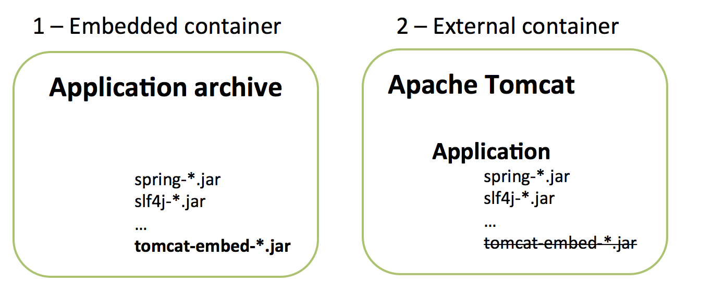
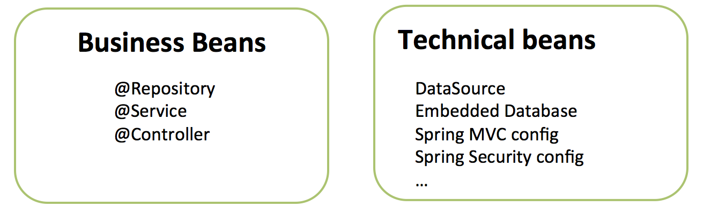

# Spring Boot without the hype

It is summertime and we are taking it as an opportunity to enhance Spring Boot coverage in our Core-Spring training course.
In the process, we have had lots of conversations with people getting started to Spring Boot and we realize that some points tend to be misunderstood. Hopefully the below points will help to shed some light. In particular, we will discuss how Spring Boot integrates with existing Java applications (the ones built with ~~Java Config~~ XML, ~~YAML~~ properties files, external containers...)

## Embedded container... if you'd like

Some people tend to think that Spring Boot forces you to embed your container (app server) inside your application.

You can actually work in 2 ways as shown in the diagram below:




Note: in the above example we have used Apache Tomcat as an embedded container. You could just as well use Jetty or Undertow.


1) The application is packaged as a war file so it can be run inside an external application server just like any Java/Spring application

```Maven config


2) The application embeds the web server (Tomcat, Jetty or UnderTow) and can be run in the command line

```xml
Maven config
```

```
how to deploy
```

There are pros and cons for each solution [as explained here](https://www.reddit.com/r/java/comments/36nt73/war_vs_containerless_spring_boot_etc/).

## Component scanning: all you can eat!

Let's consider the below example. As you can see, ComponentScan has been declared without any package path:

```java
@Configuration
@EnableAutoConfiguration
@ComponentScan
public class MyAppConfig {
   ...
}
```

By default, the current package is scanned as well as all its sub-packages.

If we take the example of Spring Petclinic, that means the following packages will be scanned:

--> list of packages

You can see that we have at least 2 sub-packages that do not contain any class to be scanned (model and util).
Lots of people would prefer Spring to avoid scanning those 2 sub-packages. It's easy to understand why:
- some people could include `@Component` files into the wrong packages by mistake. If that happens, those components should not be loaded.

- The application startup time is going to be slightly higher (granted we're just talking about milliseconds here)

In order to provide a white-list of all packages to be scanned, you just have to list them out as shown here:

```java
@Configuration
@EnableAutoConfiguration
@ComponentScan({"org.springframework.petclinic.repository",
"org.springframework.petclinic.service",
"org.springframework.petclinic.web"})
public class MyAppConfig {
   ...
}
```

```
Note: @SpringBootApplication is a nice 1-line replacement for the 3 annotations used above.
At the time of writing, @SpringBootApplication does not allow you to provide a white-list of packages.
However there are some [discussions on this topic](https://github.com/spring-projects/spring-boot/issues/3368).
```


## XML or Java Config
Once upon a time (somewhere around 2005), the world was simple: Spring only proposed XML and beginners didn't have to choose between 3 ways of doing dependency injection (XML, annotations, Java Config).

10 years later, we have lots of options. Spring is typically used in 2 ways:



You'll find lots of examples online using Spring Boot with Java configuration. Spring Boot also works well with Spring XML configuration.

TODO: check that I can redefine beans using XML

```java
@Configuration
@ImportResource("classpath:/config/business-config.xml")
public class Application {
 	//...
}
```


## .properties files or YAML
Completely your choice
show one way and the other
one thing you only can do with YAML files (profiles)
